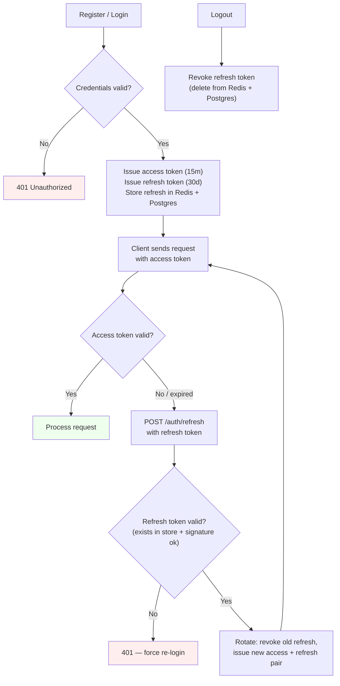

# Finance Tracker API
#### This project was made to illustrate my programming skills, as I am too young to have any real experience yet.

Finance tracker API is a backend for an application that track your finances. It handles the following features:
- Storing your transactions inside a database.
- Categorizing them using categories and tags.
- Setting budgets for your total expenses or individual categories.
- Generating information reports on your transactions using a background worker.
- Recieving notifications for events like exceeding budget or finishing report generation via an SSE event stream and a backgroud worker.
- JWT Authentification using access and refresh token.
- Caching using in-memory data store.
- Containarization and deployment to the cloud.
- Thoroughly automated testing with 152 tests.

# Tech Stack

The tech stack for this project is:
- Database: **Postgres** (Prisma ORM)
- Caching: **Redis** (ioredis)
- HTTP server: **Fastify**
- Type validation: **Zod**
- Background workers: **BullMQ**
- Authentication: **JWT** (jose)
- Infrastructure: **Docker**
- Deployment: **Render + Upstash**

# Authentication

I used JWT to generate access and refresh tokens for every user.

| Method | Path                       | Auth             | Description                                          |
| ------ | -------------------------- | ---------------- | ---------------------------------------------------- |
| POST   | `/auth/register`           | —                | Create a new user, return access + refresh tokens    |
| POST   | `/auth/login`              | —                | Verify credentials, return access + refresh tokens   |
| POST   | `/auth/refresh`            | refresh          | Rotate refresh token, return a new token pair        |
| POST   | `/auth/logout`             | refresh          | Revoke the given refresh token                       |
| POST   | `/auth/promote-admin/:id`  | access + admin   | Promote another user to `ADMIN` role                 |

Access token - expires in 15 minutes. Used to gain access to the API. It is required in authorization header with every request, and gets checked against a token secret to verify it. Access token is stateless, so it is not stored anywhere on the server, this eliminates a need for a DB-look up on every request.

Refresh token - expires in 30 days. Used to get a new access token. It is stored in postgres and is mirrored to redis for faster look-ups. It is generated on registration/login and gets revoked on logout.

There are also admin users, that can edit any other user in the system. From the start, seed generates one admin user, that can later promote other users to admins.

Authentication flow diagram:


# Users

| Method | Path                  | Auth                | Description                                                |
| ------ | --------------------- | ------------------- | ---------------------------------------------------------- |
| GET    | `/users`              | access              | Paginated list of users (`?page=1&limit=20`), cached       |
| GET    | `/users/:id`          | access              | Get a single user by id, cached                            |
| PATCH  | `/users/:id`          | access + self/admin | Edit user fields, invalidates user + page caches           |
| PATCH  | `/users/:id/password` | access + self/admin | Change password (requires old password)                    |
| DELETE | `/users/:id`          | access + admin      | Delete user, revoke their refresh tokens                   |

User routes consist of CRUD operations, that are safe guarded by authentication pre-handler, that validates user refresh token. All users are stored to prisma and are cached to redis using read-through cache with TTL and write-through invalidation on mutations.

```ts
server.get("/users/:id", {
    ...
}, async (request, reply) => {
    // Extract user ID to look for from request
    const { id } = request.params
    // user:${id} is the path in which user is stored in redis
    const cacheKey = `user:${id}`

    // check if user in redis (MUCH FASTER then checking postgres)
    // usually takes 0.1 to 1 millisecond to complete
    const cachedUser = await redis.get(cacheKey)
    // if it is - send it; end the function
    if (cachedUser) {
        return reply.code(200).send(JSON.parse(cachedUser))
    }

    // if it is not, get it from postgres (MUCH SLOWER then checking redis)
    // usually takes 2-10 milliseconds to complete
    const user = await prisma.user.findUnique({
        where: { id },
        omit: { password: true }
    })
    // if it is not in postgres, then user doesn't exist
    if (!user) {
        return reply.code(404).send({ message: "User with this ID does not exist!" })
    }

    // put it into redis, so that next time you try to get this user...
    // ...it will already be in redis
    await redis.set(cacheKey, JSON.stringify(user), "EX", 60)
    return reply.code(200).send(user)
})
```

There is also pagination implemented on the (GET) /users route for retrieving a lot of users at once. It accepts page number and limit of how many users to take. Pages also get cached, to avoid an expensive query if request gets repeated, but pages also get invalidated if any user information changes.

This is how user schema looks:

```prisma
model User {
  id        String   @id @default(uuid()) @db.Uuid
  password  String
  name      String   @unique
  createdAt DateTime @default(now())
  refreshTokens RefreshToken[]
  role      Role     @default(USER)
  categories   Category[]
  tags         Tag[]
  transactions Transaction[]
  reports   Report[]
  globalLimit Int?   @default(0)
}
```

Global limit is a budget that applies to every single transaction, regardless of it's category, so if all category spendings combined exceed global budget, user will recieve a notification.